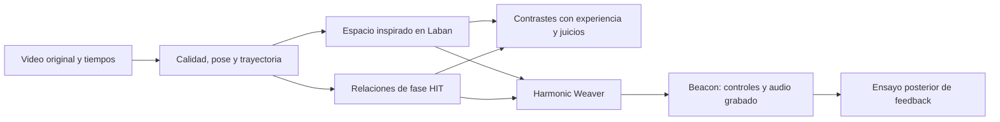

# Movimiento armónico

**Del gesto que vemos al movimiento que podemos medir y escuchar.**

Queremos investigar si la organización espacial y temporal de un movimiento se relaciona con la fluidez que vive quien lo hace, con su belleza percibida y, en tareas comparables, con su costo fisiológico. El primer caso propuesto es una práctica de **rope flow**. Es una investigación del **equipo de Harmonic Beacon sobre el movimiento**; las intuiciones iniciales son preguntas para contrastar, no resultados.

| Laban y su compañía, Ascona, 1914 | Danza contemporánea, 2009 |
|:---:|:---:|
|  |  |

*Fotos de contexto: la imagen contemporánea **no muestra a Nico ni rope flow**. [Créditos y licencias](#fotografías-y-créditos) al final.*

> **Estado:** hay dossier, protocolos y bancos sintéticos reproducibles. **Todavía no hay mediciones del caso principal ni una cadena de video a audio Beacon validada.** La simulación comprueba el diseño de las medidas; no demuestra belleza, menor gasto o un estado de conciencia en una persona.

## La idea, para personas

En una misma figura de soga pueden cambiar el recorrido de las manos, la relación entre sus tiempos, el esfuerzo que siente quien se mueve y lo que ve una audiencia. Queremos registrar esas capas sin decidir de antemano que siempre coinciden. También importan los desacuerdos: un gesto hermoso pero costoso, una coordinación estable que no se sienta bien, o una transición expresiva que rompa la regularidad.

Empezamos por **Laban** para describir dónde y cómo viaja el cuerpo. Después ponemos a prueba relaciones temporales inspiradas en **Harmonic Information Theory (HIT)**: fase, recurrencia y estabilidad entre señales independientes. Escuchamos la experiencia de quien se mueve con preguntas cercanas a la atención somática de **Kaparo**. **Levin** ayuda a formular preguntas sobre organización y adaptación biológica a otra escala; su trabajo no se toma como prueba directa de este movimiento. Finalmente, **HarMoCAP → Harmonic Weaver → Beacon** puede traducir señales validadas a sonido y permitir estudiar qué cambia cuando alguien oye su movimiento.

El **primer paper** previsto es de método y factibilidad: qué se puede medir con error conocido en rope flow. Las asociaciones con estética y experiencia, el costo oxidativo y el efecto causal del sonido son estudios separables. [Dossier completo en PDF](docs/DOSSIER_MOVIMIENTO_ARMONICO.pdf) · [versión editable](docs/DOSSIER_MOVIMIENTO_ARMONICO.docx).

## Investigación del equipo y referentes

El programa pertenece al **equipo de Harmonic Beacon**. Las funciones concretas y la autoría de futuros artículos se acordarán según contribuciones efectivas, consentimiento y revisión del manuscrito; este README no reparte autoría individual ni presenta a los referentes como integrantes del equipo.

| Marco o recurso | Cómo entra en el estudio | Límite |
|---|---|---|
| **Análisis espacial de Rudolf Laban** | Kinesfera, recorridos, dirección y cualidades dinámicas. | Nuestras fórmulas son traducciones actuales inspiradas en sus obras, no ecuaciones que él publicó. |
| **Harmonic Information Theory (HIT)** | Predicciones refutables sobre fase, recurrencia y estabilidad. [Fuente y autoría de la obra](research/sources/HIT_extractos.md). | Sus conjeturas no están verificadas en rope flow. |
| **Risa F. Kaparo** | Vocabulario de atención somática y experiencia corporal. | No es una escala validada para esta tarea. |
| **Michael Levin** | Marco de organización bioeléctrica y adaptación a otras escalas. | Sus experimentos no prueban conciencia elevada durante este movimiento. |
| **HarMoCAP, Harmonic Weaver y Beacon** | Captura, ruteo y futura sonificación de señales validadas. | Un control sonoro no certifica belleza, economía ni un estado subjetivo. |
| **IA colaboradora** | Ayuda a buscar, programar fixtures, documentar y revisar. | Cada aporte debe ser trazable y evaluado por personas; la IA no convierte simulaciones en observaciones humanas. |

## Qué ya tenemos y qué falta

| Ya preparado | Falta comprobar con el mundo real |
|---|---|
| [Plan centrado en Laban](research/PLAN_INVESTIGACION.md), [protocolo piloto](research/PROTOCOLO_PILOTO_V0.md) y [contrastes](research/ESTIMANDOS_Y_CONTRASTES.md). | Leer íntegramente las obras principales de Laban y revisar categorías con una persona formada en ese marco. |
| [Dataset sintético](research/REPORTE_SINTETICO_PRESENTACION.md): 960 filas, cuatro condiciones y cuatro audios. Contar sólo cierres de vuelta borra una diferencia dentro del ciclo; fase cero y antifase estable dan la misma concentración `R=1`. | Probar cámaras, sincronía, oclusiones, soga y referencia independiente. Hay aproximadamente cuatro Reolink, cuatro «logicam» y un Moto G; faltan modelos y originales de prueba. |
| Auditoría de [HarMoCAP → Weaver → Beacon](research/RUTA_HARMOCAP_WEAVER_BEACON.md) y [traza hasta audio](docs/TRAZA_VIDEO_BAILE_A_NICO.md). | Registrar audio realmente producido y tiempos de captura conservados; el MVP de Weaver todavía no demuestra la cadena live hasta el oído. |
| [Necesidades humanas y compras mínimas](docs/EQUIPO_HUMANO_Y_COMPRAS.md). | Video original consentido de rope flow, anotadores, ratings independientes y acceso a laboratorio sólo si se investiga costo oxidativo. |

La próxima demostración audiovisual usa primero un **video de baile autorizado** para probar la cadena técnica; luego un video del caso principal, si está disponible y autorizado; finalmente un estudio separado de feedback vivo. Ninguna foto de este README se usará como dato: una fotografía aislada no contiene trayectoria ni fase.

## Por dónde entrar

**Si sos parte del equipo humano:** leé el [dossier](docs/DOSSIER_MOVIMIENTO_ARMONICO.pdf), revisá [lo que necesitamos de cada persona](docs/EQUIPO_HUMANO_Y_COMPRAS.md) y elegí una tarea en el [tablero de 13 issues](https://github.com/SairaAsua/movimiento-armonico-investigacion/issues/14). Los videos y consentimientos se coordinan fuera de GitHub.

**Si sos una IA que va a trabajar acá:** empezá por [AGENTS.md](AGENTS.md), luego [el índice de investigación](research/README.md), el [protocolo piloto](research/PROTOCOLO_PILOTO_V0.md), el [diccionario de señales](research/DICCIONARIO_SENALES_V0.md) y la issue dueña. Conservá las distinciones `sintético/humano`, `2D/3D`, `observado/retenido/inválido`, `predicción/causalidad` y `señal cinemática/costo metabólico`. No inventes grabaciones, citas ni mediciones.

Los scripts y audios de ejemplo viven en [`research/datos_sinteticos_presentacion/`](research/datos_sinteticos_presentacion/resultados.json). Para repetir el fixture: `python research/experimento_sintetico_presentacion.py`. Los originales externos citados en las notas no se redistribuyen aquí.

## Fotografías y créditos

- **Laban y compañía, Ascona (1914):** autor desconocido; [archivo y procedencia en Wikimedia Commons](https://commons.wikimedia.org/wiki/File:Rudolf_Laban_and_dancers,_1914.jpg), marcado allí como dominio público. Foto histórica de contexto; no es un dato de este estudio.
- **“Bend and Snap”, danza contemporánea (2009):** [Nazareth College](https://commons.wikimedia.org/wiki/File:Bend_and_Snap,_contemporary_dance_performance_at_Nazareth_College_Arts_Center,_Rochester,_New_York_-_20090925.jpg), licencia [CC BY 2.0](https://creativecommons.org/licenses/by/2.0/). Se conserva sin modificar. No representa rope flow ni al caso de estudio.

**Privacidad:** no subir videos originales de personas, consentimientos, rutas locales, credenciales ni datos crudos a GitHub. El estado de trabajo vive en las [issues](https://github.com/SairaAsua/movimiento-armonico-investigacion/issues); este README explica el programa, no sustituye el registro de decisiones.
