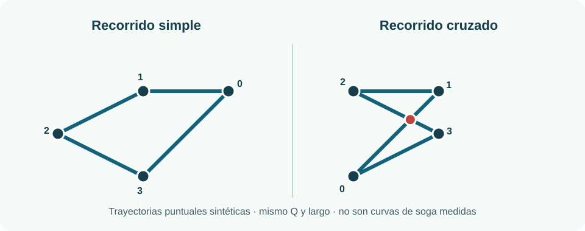

# Mismo `Q`, mismos tramos, distinto cruce del recorrido

**Contraejemplo matemático del 3 de octubre de 2026.** El descriptor `Q` propuesto en [nuestra matemática espacial](LABAN_MATEMATICA.md) resume componentes direccionales ponderadas por largo. Este [banco ejecutable](q_cruces_orden_sintetico.py) muestra que conservar incluso el **multiconjunto completo de desplazamientos** no recupera el orden de la trayectoria. No representa la soga de Nico, una escala histórica de Laban ni una afirmación sobre belleza o eficiencia.

## Construcción

Ambos recorridos planos parten de `(0,0)`, vuelven allí y usan exactamente una vez los desplazamientos `(-2,0)`, `(-2,-1)`, `(2,-1)` y `(2,2)`. Sólo cambia la secuencia:

| Trayectoria | Vértices en orden | Cruces propios de aristas no adyacentes |
|---|---|---:|
| Simple | `(0,0)→(-2,0)→(-4,-1)→(-2,-2)→(0,0)` | `0` |
| Cruzada | `(0,0)→(2,2)→(0,2)→(2,1)→(0,0)` | `1`, entre aristas 0 y 2 |

La igualdad del multiconjunto implica igualdad exacta de longitud, suma de direcciones con signo, histograma de direcciones sin orden y de todo descriptor que sume una función de cada tramo sin atender a su posición temporal. Para el `Q` de la ecuación experimental, con ejes `x,y,z` y pesos `||d_i||/L`, ambos dan `L=9,30056307974577` y `Q=(0,7517740879151031;0,24822591208489683;0)`. Un detector geométrico de intersección propia sí los separa: en el segundo caso, las aristas primera y tercera se cruzan en sus interiores. Dos ejecuciones del script produjeron JSON idéntico (SHA-256 `35dcc91e98ee801dca400c3ab8933d863f5f95432dd997f481c88033bdfabdbd`).

Este **cruce de una trayectoria puntual dibujada a lo largo del tiempo** no es un autocruce de la curva completa de una soga en un instante ni dice qué tramo de soga pasa por encima en 3D. El script cuenta sólo intersecciones propias de interiores de aristas no adyacentes, no contactos o superposiciones. Los cruces de soga exigen línea central, identidad de segmentos, profundidad y visibilidad propias; la [nota de identificabilidad de soga](SOGA_IDENTIFICABILIDAD.md) y la [auditoría DLO](SOGA_VISION_DLO_FUENTES.md) delimitan esa prueba. Tampoco se deduce una topología física de rope flow desde un trazo 2D de muñeca.

## Consecuencia para el estudio y la escucha

La inferencia espacial inspirada en Laban debe conservar **secuencia de líneas, puntos de cruce y ventana**, además de `Q`, cuando la pregunta sea cómo se organiza un recorrido. Antes de interpretar un cruce desde video, registrar si se trata de autocruce de trayectoria en tiempos distintos, cruce de soga proyectado simultáneo o paso delante/detrás confirmado en 3D. En el piloto, una categoría de cruce sólo será válida en tramos con identidad y error evaluados; de otro modo `unknown`, sin completar con la figura que se esperaba ver.

Si ambos recorridos se ejecutaran con una vuelta de igual duración, una fase interpolada **sólo entre cierres de ciclo** daría el mismo reloj a los dos. Un mapeo determinista que reciba únicamente ese reloj y `Q` tampoco podría hacer audible la diferencia de orden/cruce. La [especificación de fase](FASE_ROPEFLOW.md) ya exige microtiempo independiente cuando importa la organización intracíclo; la [ruta futura hacia Beacon](INTEGRACION_HARMOCAP_BEACON.md) necesitaría una señal validada de secuencia o cruce si pretende comunicar esa propiedad. `Q` permanece útil para la distribución de desplazamientos que sí mide; este ejemplo fija su frontera informativa.
